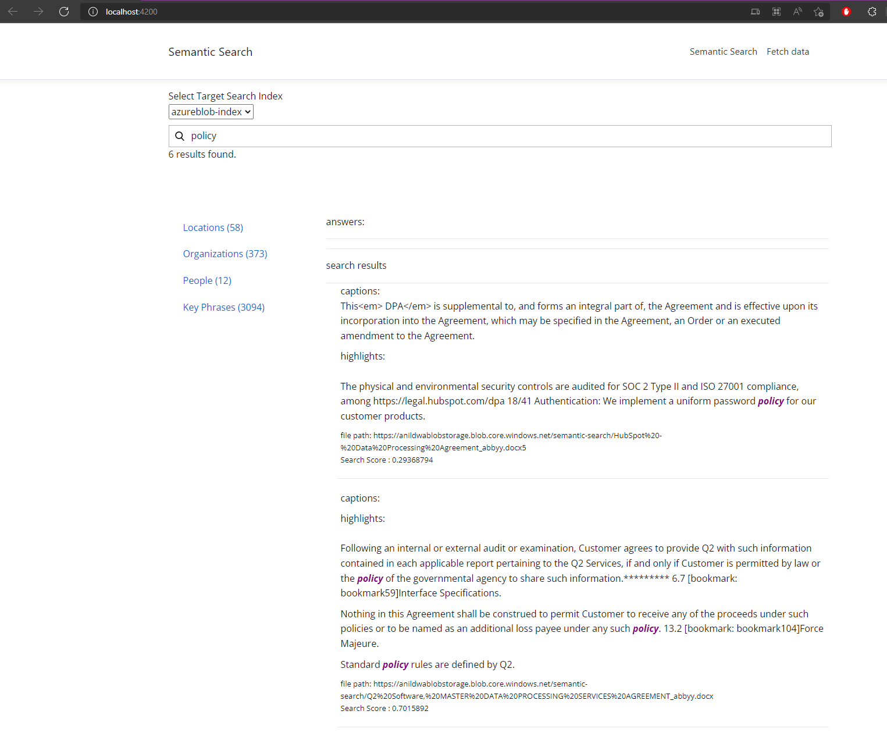

# Azure Semantic Search Demo

This repo can be used to see some the Azure Cognitive Search's Semantic search capabilities. This creates local web app that can be used to explore some of the capabilities. 
The UI is created with Angular, and backend API uses Flask to host the APIs.

        Spell Checking
        Semantic Ranking
        Top Answers
        Captions
        Highlights
        Faceted Search
        Azure Cognitive Search Skills for Text Analytics, Key Phrases, Entity Extraction 

Prerequisites

        Azure Search Service with Semantic Search feature enabled. 
        Azure Storage - Update a few sample files to this storage container. 
        python installed on local environment. 
        flask and flask-cors packages installed. 
        Angular CLI version 12.1.4 or later. 

### Steps to get this running

#### Step 1

Clone this repo and configure search index using the azure-search-with-custom-index.ipynb

#### Step 2

Configure Environment variables and launch Search API using flask

        # on Windows Powershell
        $env:FLASK_APP = "flask-webapp"
        $env:SEARCH_API_KEY = "<Search API KEY>"
        $env:SEARCH_ENDPOINT = "<search-service-name>.search.windows.net"

        # on Linux
        export FLASK_APP="flask-webapp"
        export SEARCH_API_KEY="<Search API KEY>"
        export SEARCH_ENDPOINT="<search-service-name>.search.windows.net"

        cd search-api
        flask run

#### Step 3

Run Angular CLI web app

        cd ClientApp
        ng serve

Navigate to http://localhost:4200/

